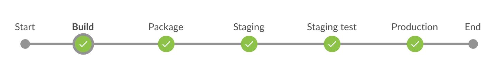
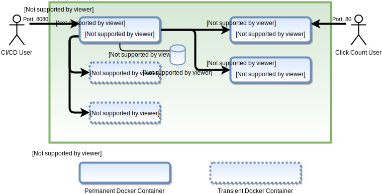

# Xebia CI/CD Pipeline

A CI/CD Pipeline for the web application "Click Count", based on Jenkins and
Docker.



## Introduction

This document describes the Pipeline for a Web application written in Java that
compile with Maven. The backend of this application consists only of a Redis
database.

The Pipeline infrastructure is independent of the WebApp and can be reused for
anything else. This document describe both the Pipeline infrastructure and the
application, and how to reproduce the Pipeline elsewhere.

The sources are split in two Git repositories:
* This repository that contains the infrastructure description and the
  Dockerfile of the CI/CD application (Jenkins).
* [The application sources](https://github.com/capuchon-dev/click-count) which
  contains the WebApp sources, the tests, the Pipeline as code (Jenkinsfile) and
  a set of Dockerfiles to bypass dependencies problems, amongst which the
  Dockerfile for the WebApp itself (the one that will be deployed by the
  Pipeline).

The Pipeline and the WebApp are deployed on the cloud in order to see them in
action. URLs are provided by mail (they are not protected, no HTTPS, no Reverse
Proxy, so its better to not publish them in a public space).


## Architecture



The idea behind this architecture is to have Docker containers for everything.
This simplify the host configuration, manage the dependencies in a elegant way
and simplify the transposition to another infrastructure (more on this later).

There is three types of containers in this architecture:
* Jenkins itself. This is the CI/CD server. Jobs are stored in a Docker Volume
  to ease persistence, backup and recovery.
* Transient containers instantiated on demand by Jenkins to operate some
  Pipeline steps, like the WebApp build or the REST API tests.
* Applications containers. Used for Stagging and Production, these containers
  contain the WebApps themselves.

This schema present a version of the architecture, where choices was made in
order to achieve the goal as quickly as possible. It is perfectible a lot, as
described [later in this document](#improvements). These choices are:

* Jenkins used as the CI/CD scheduler. Other choices could have been made
  (Travis, AWS CodePipeline and CodeDeploy, ...), but I like Jenkins for its
  rich plugin library, it versatility, and its recent evolution to Pipelines.
* Everything described as code and committed to Git. This makes the Pipeline
  easy to transpose in a different context. The application itself comes with
  everything needed to test, package and deploy it. This means the involved
  Dockerfiles, tests and the Jenkins Pipeline are all committed in the WebApp
  sources repository. Everything come together from code to deployment. Only
  the CI/CD infrastructure itself is separated in another repository, because
  not directly related to the WebApp (the same CI/CD can be used for many other
  applications, whatever their language used). But you will notice that this
  CI/CD infrastructure as code is very small (a Docker container with Jenkins
  and some useful plugins pre-installed).
* Tomcat is used as the servlet container for the Java application (currently:
  Jenkins itself and the Click Count WebApp).
* Docker used everywhere. Especially, Jenkins itself is described by a
  Dockerfile, but is very simple: only some useful plugins pre-installed, that's
  all! This Jenkins can instantiate transient sibling containers to do some
  tasks that it can't do itself. Currently, the WebApp build and the REST API
  tests are done this way. For example, the REST API tests are done using
  Python, but the Jenkins container can't do that because Python is not
  installed in it. This illustrate the strength of this architecture: whatever
  we have to build or execute, this will be possible because we will create a
  Docker container for this, with the needed dependencies, **without having to
  modify the Jenkins container** which will remain minimal and generic.
* Small Docker containers. Thanks to responsibility separation and the
  systematic use of [Alpine Linux](https://alpinelinux.org/), the different
  containers involved are small while doing what they have to do. On the long
  term, this can bring operations cost saving (smaller cloud instances, ...).
* This first version of the architecture has the advantage to run entirely in
  one host. This is not very suitable for real life cases as
  [described later](#improvements), but is just a first step and make the whole
  setup very easy.

Some advantage of the solutions retained are:
* Easy to transpose, easy to evolve.
* CI/CD and applications consideration well separated. The application
  repository comes with everything to test, build and deploy it. The CI/CD
  infrastructure in independent.
* Open a lot of doors for real life evolutions. This architecture can scale very
  well for projects that will grow and can become complex.


## Deployment guide

### Generic infrastructure

Thanks to infrastructure as code, the deployment of this Pipeline is simple.
You only need a Linux instance, locally or in the Cloud, with Docker installed,
and the Docker daemon running.

Due to the simplicity of this first version, no infrastructure as code as been
done for the host part (AWS CloudFormation, Terraform, ...). It currently has
to be done manually:

* Instantiate or use a Linux and install these packages (names can change
  between distributions):
  * docker
* Make the docker service running. On most distribution, this will be:
  * `sudo service docker start`
  * `sudo chkconfig docker on`
* Make the Docker local socket readable and writable for anybody on the host,
  for Jenkins to be able to create sibling containers:
  * sudo chmod 666 /var/run/docker.sock
* Make your Linux user to be a part of the 'docker' Unix group. This differs a
  lot between distributions, and generally require a log/delog if you want to
  play with docker manually and immediately.
* For ease of use, the Jenkins Docker image is available on Docker Hub, so you
  don't have to build it yourself. Note that this is the result of the
  `Dockerfile` at the root of this document repository.
  * `docker run -d -p 8080:8080 -v /var/run/docker.sock:/var/run/docker.sock -v jenkins_home:/var/jenkins_home --name xjenkins capuchon/xjenkins`

> **WARNING**: On recent Docker versions for MacOS, local socket usage seems
> impossible from a container due to right managements. This used to work in the
> past, but despite the time I spent on this on recent versions, I was not able
> to make it running, so I used Linux instead.


### Example on AWS

Here is an example for AWS standard Linux AMIs (not all details are included,
it is assumed you know how to use AWS instances):

* Instantiate an EC2 instance of your choice with the "Amazon Linux AMI". I
  developed the Pipeline with a "t2.micro" instance, this works very well and
  enter in the free tier. 
* Ensure your instance will have a Public IP (Auto-assign Public IP).
* Setup the instance with this script in "Advanced Details / User data":
  ```bash
  #!/bin/bash
  yum update -y
  yum install docker -y
  service docker start
  chkconfig docker on
  chmod 666 /var/run/docker.sock
  usermod -a -G docker ec2-user
  ```
* Use a classic storage (default 8 GB General Purpose SSD is ok).
* Setup a Security Group with these Inbound rules:
  * TCP 22 from 0.0.0.0/0 (HTTP for Click Count app)
  * TCP 8080 from 0.0.0.0/0 (Jenkins)
  * TCP 80 from 0.0.0.0/0 (Click Count Production)
  * TCP 8088 from 0.0.0.0/0 (Click Count Stage)
  * Add also IPv6 same rules if you want.
* Launch the instance, wait it is up and running.
* SSH into the instance as 'ec2-user' and launch Jenkins:
  * `docker run -d -p 8080:8080 -v /var/run/docker.sock:/var/run/docker.sock -v jenkins_home:/var/jenkins_home --name xjenkins capuchon/xjenkins`


### Setting up Jenkins

* Launch your favorite browser and go to the IP address of your Linux instance on
  port 8080:
  * Example: http://54.154.235.26:8080/
* Unlock Jenkins with the password found in the traces. From the instance shell,
  you can get the container logs with:
  * `docker logs xjenkins`
* You don't have to install any plugin, because the provided Docker container
  have all needed pre-installed. So:
  * Choose "Select plugins to install",
  * Select 'None' to deselect all plugins,
  * Select 'Install'.
* Create an admin user of your choice (follow the on screen instructions).
  Select "Save & Finish".
* "Start using Jenkins".
* Welcome to our CI/CD !


### Setup the Click Count Pipeline

Due to GitHub rights management, you will have to fork the
[click-count GitHub project](https://github.com/capuchon-dev/click-count) to
do the next steps, in order to have write access to the repo (used by Jenkins
Pipeline to commit the Jenkinsfile and make GitHub integration).

Under Jenkins web interface:
* Select "Open Blue Ocean" on the left.
* Select "Create a new Pipeline".
* Select "GitHub".
* On GitHub, [create a GitHub access token](https://github.com/settings/tokens/)
* Copy the created token into Jenkins "Your GitHub access token".
* Select the right organization and click-count repository.
* Select "Create Pipeline".
* Your done! Jenkins detects automatically the Jenkinsfile inside the
  click-count repository and run the Pipeline immediately.

After the Pipeline run, the click-count application can be used directly on the
Linux instance. Open your favorite browser to port 80:
* http://\<your instance ip\>/clickCount


### Terminate the GitHub setting

The CI/CD is now in place, and everything run, however, if you commit changes
into the click-count repo, nothing will happen... You have to setup a Webhook
on GitHub side to make the connection complete between the repository and the
CI/CD:

* On GitHub, go to your repository, "Settings".
* Select "Webhooks" on the left.
* Select "Add Webhook", confirm your password.
* In "Payload URL", put your Jenkins Webhook entry point:
  * http://\<your instance ip\>:8080/github-webhook/
* Keep the other options as-is and select "Add webhook".

This time, it's really done! Each time modifications are pushed on GitHub, the
Pipeline will run and a new version of click-count will be deployed (if tests
are ok).


## Improvements

This CI/CD Pipeline works, but is far from perfect. This is an MVP (Minimum
Vital Product). To make it production-quality, we have to iterate on it. Here
is the most identified improvements for future releases:

* Everything is on the same host (CI/CD and the Stagging and Production WebApp).
  This makes the Pipeline easier and faster to write and setup. However, the
  WebApps should be deployed on another host in real life, to separate the CI/CD
  from the apps server(s). Thanks to Docker, this architecture open the door for
  this in a next step.
* No orchestration used, only pure Docker. Again, this is to have a quick setup.
  A next step should use real orchestration to deploy the WebApps, and for the
  CI/CD itself. [OpenShift](https://www.openshift.com/) is one of the
  possibilities amongst many others.
* In this version, Jenkins communicate with the host Docker Engine through the
  host docker local socket in order to create "sibling" containers. Note that it
  cause problems on recent versions of Docker for MacOS. This works well on
  Linux however.
* No Reverse Proxy used, the Tomcat containers are exposed directly to the open
  internet. Again, this is to reach the MVP faster. A next step would be to
  have a Reverse Proxy in front of Jenkins and in front on the WebApps. And
  because the CI/CD and the WebApps should be separated, each host should have
  its own Reverse Proxy for, respectively, Jenkins and the WebApps.
* No SSL (HTTPS). Everything is HTTP, and yes, the Jenkins password at login
  go to the internet in clear plain text. This is again to have the Pipeline
  working ASAP, and also because no Domain Name have been setup for it yet. In
  real life, both the CI/CD and the WebApps should have their domain (or sub
  domain), their SSL certificate, and everything should be HTTPS. This should be
  configured at Reverse Proxy level, using for example
  [Let's encrypt](https://letsencrypt.org/).
* The Pipeline validate the WebApp on Staging using only the app REST API. For
  a bigger and real WebApp, the HTML part should be tested also, using for
  example [Cucumber](https://cucumber.io/).
* Versioning not yet managed. The Pipeline ensure some part of traceability
  between sources and production. However, this is far from perfect. A real
  versioning management should be implemented in order to be able, using the
  HTML part of the WebApp, to be able to identify the version in production and
  being able to trace it back to the Git sources easier.
* Multibranch not yet well managed (containers conflicts between branches).
  Also, not all branches should induce a production deployment, only 'master'.
  Other branches should stop after stagging validation.
* No automatic backups yet. This is not a big issue, since this architecture use
  infrastructure as code and Pipeline as code. However, the Jenkins Home
  contains build history and artifacts that would be valuable to maintain.
  Thanks to Jenkins plugins and/or the fact that Jenkins Home is in a Docker
  Volume, this backup process is easy to implement, but is left for a next step
  due to its non critical nature in this case.
* Not everything is described as code: cloud deployment of the host is currently
  manual, because simple. Bigger real life CI/CD should have cloud templates
  (AWS CloudFormation, [Terraform](https://www.terraform.io/), ...).


## Development story

Here, I will speak about the steps I followed to develop this CI/CD and
click-count Pipeline.


### Main steps followed

* Dockerization of the web application. Two Dockerfiles was created:
  * One to build the application through Maven (to avoid having to install
    Maven on my laptop). This container is finally not used in the Pipeline,
    it was useful only on early stage to work by hand.
  * One to run the application inside a Tomcat Servlet container. This container
    is used by the Pipeline.
* Make the web application Redis backend configurable through environment
  variables. This works also through Docker of course. This makes the same
  build usable for Stage and Production. The Pipeline do just that at Docker
  level (passing Redis config to the container that the Java app will read).
* Creation of the Jenkins Pipeline. Configuration to make complete GitHub /
  Jenkins connections. Pipeline launch automatically on git push.
* Write click-count REST API tests in Python using `unittest`.
* Dockerify the REST API tests (tests run from a sibling container). Integration
  into the Pipeline.
* Tuning and improve the Pipeline and add Docker cleanups.


### Problems encountered during this Pipeline development

The goal to reach was clear to me since the beginning. However, we all know that
IT is full of problems that makes linear progression impossible. Here is the
list of problems that cost me the most of time:

#### CA Certificates bug in Debian.

At the very beginning of this work, I lost a lot of time because Maven couldn't
load the application dependencies. At this time, to try faster by hand, I used
an Ubuntu Linux through Docker. After many investigations, it appeared this is
a bug in Debian (Ubuntu is based on Debian).

The problem is Java/Maven need the SSL CA certificates in 'jks' format. Debian
switched to 'pkcs12' format. The problem is fixed in Debian, but not yet in
Ubuntu at this time writing. There is a workaround that I used to go forward.
However at the end, the problem does not exists anymore in the final Pipeline
because I use Alpine Linux in the containers, which don't have this bug.

See the bug description [here](https://bugs.launchpad.net/ubuntu/+source/ca-certificates-java/+bug/1739631).

#### Docker socket access rights on recent Docker versions for MacOS.

Before going into the Cloud, my plan was to setup the whole CI/CD locally on my
Mac. However, recent versions of Docker for Mac have serious problems when using
the Docker local socket from inside a container to make sibling containers.
It used to work in the past, but I wasn't able to make it working again with
newer Docker versions. So I switched to real Linux where the problem does not
exist (the problem comes from the specificities of MacOS regarding access
rights).
